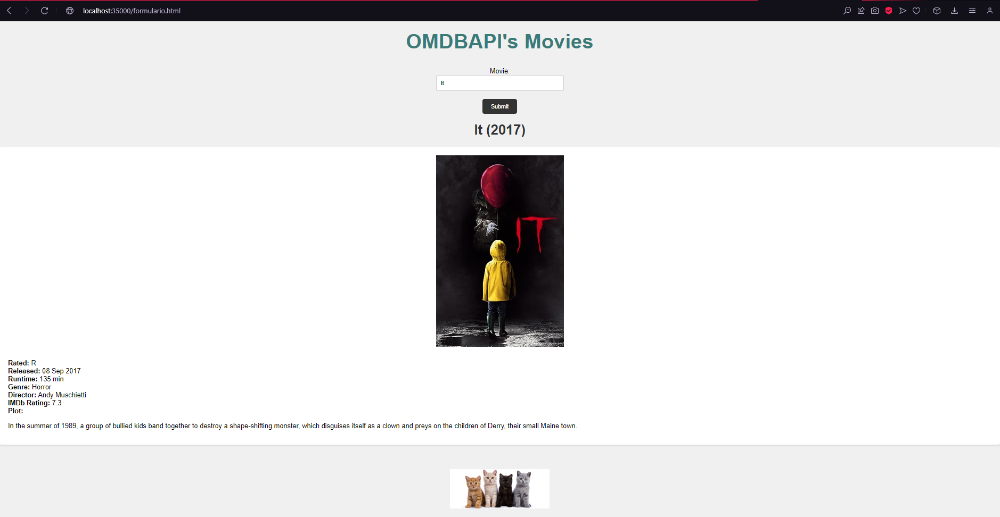
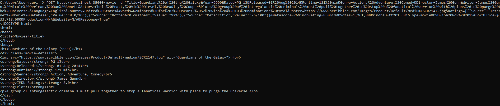
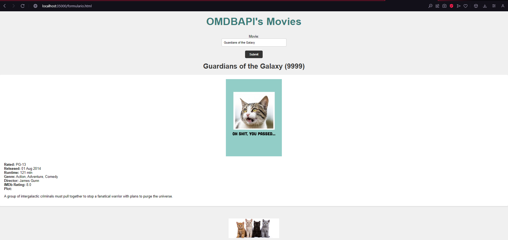
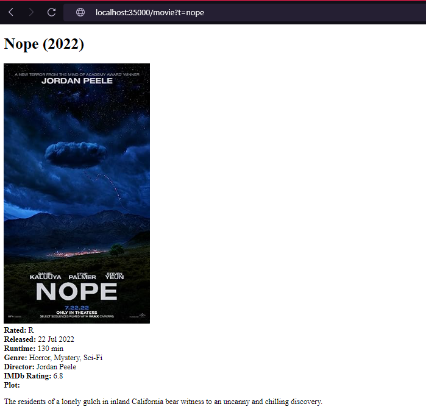
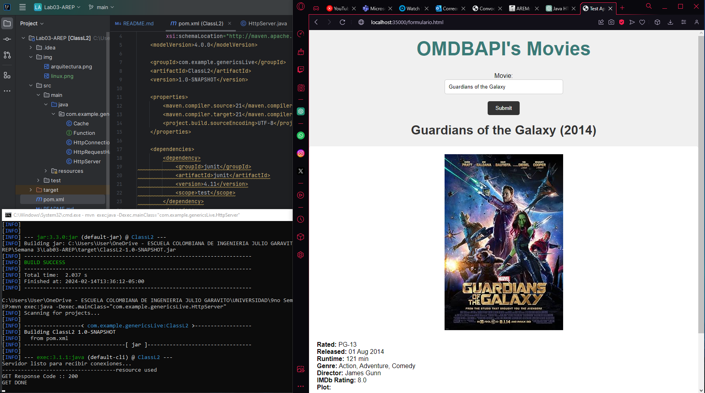
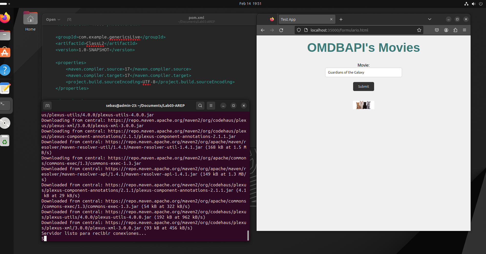

# Lab03-AREP

## Servidor HTTP Básico

Este proyecto consiste en un servidor HTTP básico que proporciona funcionalidades similares a las del microframework Spark. El servidor permite configurar servicios web de tipo GET y POST utilizando funciones lambda, así como entregar archivos estáticos como páginas HTML, CSS, JS e imágenes. Además, es posible configurar el directorio de donde se leerán los archivos estáticos y leer parámetros del query desde los programas.

## Descripción General del Proyecto

El servidor HTTP implementado en este proyecto permite el registro de servicios web de tipo GET y POST mediante el uso de funciones lambda. También admite la entrega de archivos estáticos, como páginas HTML, CSS, JS e imágenes. Se puede configurar el directorio de donde se leerán los archivos estáticos, lo que proporciona flexibilidad en la estructura del proyecto. Además, el servidor es capaz de leer parámetros del query desde los programas, lo que facilita la manipulación de datos en las solicitudes.

## Arquitectura del Prototipo

El prototipo sigue una arquitectura cliente-servidor, donde el servidor HTTP actúa como el servidor que escucha las solicitudes entrantes de los clientes. El servidor utiliza un enfoque asíncrono para manejar las solicitudes de manera eficiente, utilizando múltiples subprocesos.

### Componentes Principales

1. **Servidor HTTP:** Es el componente central del prototipo que recibe las solicitudes HTTP de los clientes y genera las respuestas correspondientes. Utiliza la API básica de Java para la comunicación de red.

2. **Manejador de Solicitudes:** Este componente se encarga de manejar las solicitudes HTTP entrantes. Lee la solicitud, determina el tipo de método HTTP utilizado (GET, POST, etc.), y llama a los controladores correspondientes para procesar la solicitud.

3. **Controladores:** Los controladores son funciones lambda que procesan las solicitudes HTTP. Dependiendo del método HTTP y la URI solicitada, se invoca al controlador correspondiente para generar la respuesta.

4. **Lector de Archivos en Disco:** Cuando se recibe una solicitud GET para un archivo estático (como un archivo HTML, CSS, JS o una imagen), el servidor utiliza este componente para leer el archivo del disco local y enviar su contenido como respuesta.

5. **Cache:** El caché se utiliza para almacenar respuestas previas y mejorar el rendimiento del servidor. Cuando se recibe una solicitud GET para un archivo estático, el servidor primero verifica si la respuesta está en el caché. Si lo está, la devuelve directamente sin leer el archivo del disco local.

### Flujo de Trabajo

1. El cliente envía una solicitud HTTP al servidor para un recurso específico (como un archivo HTML o una consulta REST).
2. El servidor HTTP recibe la solicitud y la pasa al manejador de solicitudes.
3. El manejador de solicitudes determina el tipo de método HTTP utilizado y llama al controlador correspondiente para procesar la solicitud.
4. El controlador procesa la solicitud, lee el archivo del disco local si es necesario y genera la respuesta.
5. La respuesta se envía de vuelta al cliente a través del servidor HTTP.


## Ejemplo de Uso

- A continuación se muestra un ejemplo de cómo se desarrollarían las aplicaciones en este servidor:

    ```java
    public class Main {
    
        public static void main(String[] args) {
            // Configurar el directorio de archivos estáticos
            HttpServer.setStaticFilesDirectory("/public");
    
            // Registrar un servicio GET para obtener información de una película
            HttpServer.get("/movie", (uri) -> {
                // Implementación para obtener información de la película
            });
    
            // Registrar un servicio POST para agregar una nueva película
            HttpServer.post("/movie", (uri) -> {
                // Implementación para agregar una nueva película
            });
        }
    }
    ```

- Un ejemplo de una solicitud GET
  

- Un ejemplo de una solicitud POST, agregando el dato: `curl -X POST http://localhost:35000/movie -d "Title=Guardians%20of%20the%20Galaxy&Year=9999&Rated=PG-13&Released=01%20Aug%202014&Runtime=121%20min&Genre=Action,%20Adventure,%20Comedy&Director=James%20Gunn&Writer=James%20Gunn,%20Nicole%20Perlman,%20Dan%20Abnett&Actors=Chris%20Pratt,%20Vin%20Diesel,%20Bradley%20Cooper&Plot=A%20group%20of%20intergalactic%20criminals%20must%20pull%20together%20to%20stop%20a%20fanatical%20warrior%20with%20plans%20to%20purge%20the%20universe.&Language=English&Country=United%20States&Awards=Nominated%20for%202%20Oscars.%2052%20wins%20&%20103%20nominations%20total&Poster=https://www.scribbler.com/Images/Product/Default/medium/SCR2147.jpg&Ratings=[{"Source":"Internet%20Movie%20Database","Value":"8.0/10"},{"Source":"Rotten%20Tomatoes","Value":"92%"},{"Source":"Metacritic","Value":"76/100"}]&Metascore=76&imdbRating=8.0&imdbVotes=1,261,888&imdbID=tt2015381&Type=movie&DVD=15%20Nov%202015&BoxOffice=$333,718,600&Production=N/A&Website=N/A&Response=True"`
  
  Se verifica que el dato halla sido agregado correctamente:
  

- Un ejemplo de la lectura de parametros desde el query:

  
  

## Pruebas del Proyecto

El proyecto ha sido probado en los siguientes sistemas operativos:

- Windows
  
- Linux
  

Las pruebas incluyeron la verificación de las siguientes funcionalidades:

- Registro de servicios web de tipo GET y POST.
- Entrega de archivos estáticos como páginas HTML, CSS, JS e imágenes.
- Configuración del directorio de archivos estáticos.
- Lectura de parámetros del query desde los programas.

## Instrucciones de Ejecución

Para ejecutar el proyecto, sigue estos pasos:

1. Clona el repositorio desde GitHub.
2. **Compilar el Proyecto:** Ejecutar `mvn compile`.
3. **Ejecutar el Servidor:** Ejecutar `mvn exec:java -Dexec.mainClass="com.example.genericsLive.HttpServer"`.
4. **Acceder a la Interfaz de Usuario:** Entrar desde un navegador a `http://localhost:35000/formulario.html`.

