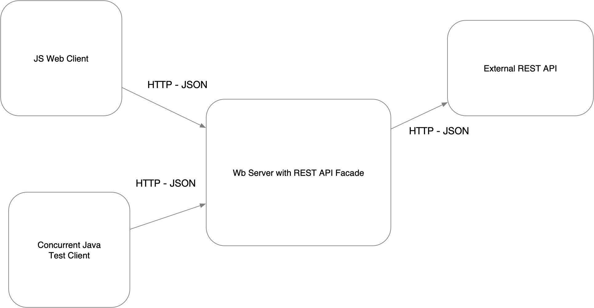

# Lab03-AREP

## Servidor HTTP Básico

Este proyecto consiste en un servidor HTTP básico que proporciona funcionalidades similares a las del microframework Spark. El servidor permite configurar servicios web de tipo GET y POST utilizando funciones lambda, así como entregar archivos estáticos como páginas HTML, CSS, JS e imágenes. Además, es posible configurar el directorio de donde se leerán los archivos estáticos y leer parámetros del query desde los programas.

## Descripción General del Proyecto

El servidor HTTP implementado en este proyecto permite el registro de servicios web de tipo GET y POST mediante el uso de funciones lambda. También admite la entrega de archivos estáticos, como páginas HTML, CSS, JS e imágenes. Se puede configurar el directorio de donde se leerán los archivos estáticos, lo que proporciona flexibilidad en la estructura del proyecto. Además, el servidor es capaz de leer parámetros del query desde los programas, lo que facilita la manipulación de datos en las solicitudes.

## Arquitectura del Prototipo

El prototipo sigue una arquitectura cliente-servidor, donde el servidor HTTP actúa como el servidor que escucha las solicitudes entrantes de los clientes. El servidor utiliza un enfoque asíncrono para manejar las solicitudes de manera eficiente, utilizando múltiples subprocesos.



## Ejemplo de Uso

A continuación se muestra un ejemplo de cómo se desarrollarían las aplicaciones en este servidor:

```java
public class Main {

    public static void main(String[] args) {
        // Configurar el directorio de archivos estáticos
        HttpServer.setStaticFilesDirectory("/public");

        // Registrar un servicio GET para obtener información de una película
        HttpServer.get("/movie", (uri) -> {
            // Implementación para obtener información de la película
        });

        // Registrar un servicio POST para agregar una nueva película
        HttpServer.post("/movie", (uri) -> {
            // Implementación para agregar una nueva película
        });
    }
}
```

## Pruebas del Proyecto

El proyecto ha sido probado en los siguientes sistemas operativos:

- Windows
- Linux

Las pruebas incluyeron la verificación de las siguientes funcionalidades:

- Registro de servicios web de tipo GET y POST.
- Entrega de archivos estáticos como páginas HTML, CSS, JS e imágenes.
- Configuración del directorio de archivos estáticos.
- Lectura de parámetros del query desde los programas.

## Instrucciones de Ejecución

Para ejecutar el proyecto, sigue estos pasos:

1. Clona el repositorio desde GitHub.
2. **Compilar el Proyecto:** Ejecutar `mvn compile`.
3. **Ejecutar el Servidor:** Ejecutar `mvn exec:java -Dexec.mainClass="com.example.genericsLive.HttpServer"`.
4. **Acceder a la Interfaz de Usuario:** Entrar desde un navegador a `http://localhost:35000/formulario.html`.

